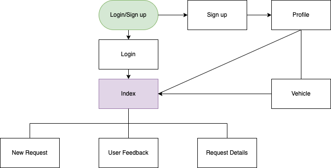

# T2A2 - Marketplace Application (Christopher Chong)
---

 ## Description of Application

- Identification of the problem you are trying to solve by building this particular marketplace app.

- Why is it a problem that needs solving?

- Purpose of app?

- Target audience?

(INCOMPLETE)

---

 ## Link to deployed Application website

Heroku:

(INCOMPLETE)

---

 ## Link to Source Control Repository

Github:

(INCOMPLETE)

---

## User Stories

Trello:

(INCOMPLETE)
<!--  -->
  

---
## Features/Functionality
This Marketplace Application will have the following features/functionalities:

<!-- 1. Display Staff current Annual Leave and Credits.
   - This feature will allow the user to retrieving leave details from the existing database.

2. Manage Staff Name (Create - save new name/Update - rename/Delete -name)
   - This feature includes:
  
     - Create new staff - New staff member will enter name, role and password and the app will auto-generate a unique Staff ID to be used for requesting and deleting leave as well as update staff name and password.  These details will be automatically added to the existing staff database.
  
     - Updating Existing Staff Name and Password - Staff login used for validating user before allowing changes to name or password in the existing database.  User input for user name and password would go through valid validation conditions (i.e. empty entries).
  
     - Deleting Existing Staff -  Staff login used for validating user, only existing staff can be deleted in the existing database.

3. Manage Staff Annual Leave (Create/Delete)
   - This feature includes:

     - Requesting Leave - Staff login used for validating user and a date validation before leave is requested.  Date validation includes, database checking for double booking of same staff member and for minimum required staff at work. 
  
     - Deleting Existing Leave - Staff login used for validating user, only existing requested leave can be deleted through database checking.  

4. Manage staff login (password validation)
   - Staff ID and password are validated through database checking and confirming they exist and their credentials match. 

5. Exit Option from Main/Leave Menu
   - To log out from the app after user has finished with it. -->

---
## Sitemap

---
## Wireframes	
<!--  -->

---
## Screenshots of Application	
<!--  -->

---

### Entity Relationship Diagram (ERD):

---

### High Level Components

(INCOMPLETE)

Explain the different high-level components (abstractions) in your app
- What this means are the entities in the ERD....list them and explain them individually...also why do they exist in the first place?
- also talk about Models and Views as part of what those Models are for...but specifically to those models. eg if you had a blog site (Post model and Comment model) Comment doesn't have its own controller but Post does

---
### Third party services

(INCOMPLETE)

Detail any third party services that your app will use

- A gem is not one, UNLESS it connects to something external.
- IMAGE UPLOAD is considered a third party service, so this is guaranteed! ...and this is also one of the requirements..R5.
- DEPLOYMENT platform is also a third party service.

---
### Active Record Associations

(INCOMPLETE)

Describe your projects models in terms of the relationships (active record associations) they have with each other

- NOT the ERD, but rather ActiveRecords associations... has_many...etc
- Could be displayed in a table..yes!...but still need to discuss the relationships and why there needs to be a relationship between those two things..

---
### Database Relations

(INCOMPLETE)

R18	Discuss the database relations to be implemented in your application

NOT the same as R17,...use ‘relational database’ language......it is a narrative discussion of the ERD.

---
### Database Schema Design

(INCOMPLETE)

R19	Provide your database schema design

- It is not talking about the schema.rb file.
- IF your ERD is complete...it will already answer this...an ERD is a visual representation of a schema.

---
## Allocation of Tasks and Project Tracking

(INCOMPLETE)

Describe the way tasks are allocated and tracked in your project

Explain if using Trello and user stories.

"Used Trello to track progress of my Marketplace app as it gives a good visual snapshot of where everything stands at any given day."

---

### Trello Progress tracking

<!-- 

 -->

---

### TECH STACK
- HTML 5
- CSS 3
- Ruby on Rails 7.0.2.3
- Ruby Gems:
  - Bootstrap
  - Devise
  - Rolify
  - Pundit
  - Bundler
- Deployment Platform: Heruko
  

 ---
 ## <u>REFERENCED SOURCES</u>
 

1.  Trello.com. 2022. Trello. [online] Available at: < https://trello.com/ > [Accessed 10 May 2022].
 
 
2.  GitHub. 2022. GitHub: Where the world builds software. [online] Available at: < https://github.com/ > [Accessed 10 May 2022].
 
 
3.  draw.io. 2022. draw.io – Diagrams for Confluence and Jira. [online] Available at: < https://drawio-app.com/ > [Accessed 10 May 2022].
 
 

