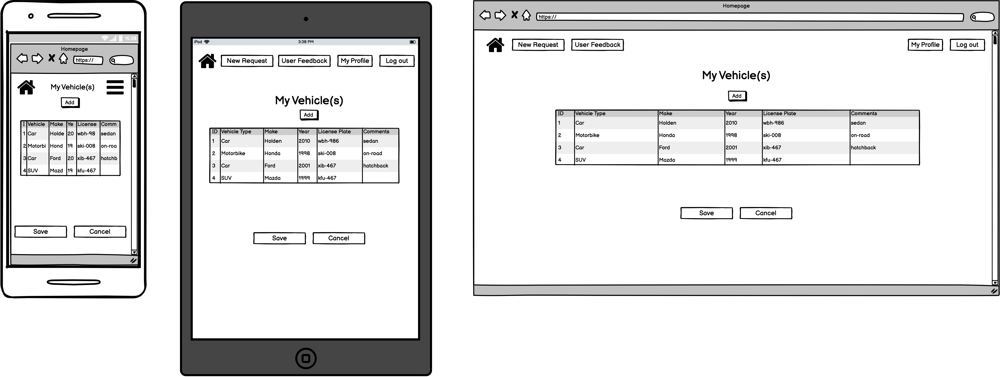

# T2A2 - Marketplace Application (Christopher Chong)
---

 ## Description of Application

- Identification of the problem you are trying to solve by building this particular marketplace app.
  - Trying to solve an issue to do with street parking where parking spots are very limited or where first come first serve is the name of the game.  By having a means to book a spot, this will attempt to solve the issue.  This is by no means a 100% guaruntee spot saving system, but it aims to give those who really want a spot a fighting chance to secure a space by letting it known to the world.  This will allow someone who is able to save/secure a parking spot to help and get rewarded in the process.

- Why is it a problem that needs solving?
  - Time and time again, I have found myself in this exact scenario, whereby there are limited spots to street parking and it is a first come first serve basis.  I kept thinking if only there was a way to secure this spot before hand, it would make life so much easier.  I have heard similar stories from other drivers, so I know I'm not the only one thinking the same thing.

- Purpose of app?
  - The purpose of the app is to provide a platform for someone in need of saving a parking spot (will be referred to as the 'customer') and someone who is willing to reserve this spot (will be referred to as the 'provider').  The 'customer' will post up a request on the website, with the location, date, time and reward on offer.  The 'provider' can either choose to accept or look for another opportunity.  If the 'provider' accepts the request, they will need to ensure that the spot can be secured, which is why the reward/payment will not be released to the 'provider' until the request has been physically fulfilled (i.e. the 'provider' waits for the 'customer' to arrive at the agreed spot and the car spot is given to the 'customer').  Upon completion of the request, the reward/payment will be released to the 'provider'.

- Target audience?
  - The target audience is anyone in need of securing a parking spot that cannot otherwise be secured through other means wihtin Australia.  It doesn't restrict to only those with vehicles, it could for example also include person travelling with someone with a vehicle.  

---

 ## Link to deployed Application website

Heroku:

(INCOMPLETE)

---

 ## Link to Source Control Repository

Github:

https://github.com/chrismyhub/save_my_spot

---

## User Stories

Trello:

(INCOMPLETE)
<!--  -->
  

---
## Features/Functionality
This Marketplace Application will have the following features/functionalities:

1. Display all requests currently available.
   - This feature will allow all users to see what requests are available to accept near them.

2. Create new requests and add them to the current listing.
   - This feature will allow those who want to request a spot to be saved to post their requests and let it be known, so that a potential 'provider' can assist with the request.

3.  Edit current requests posted.
   - This feature will allow the original poster to edit the request in case there are changes to the initial plan.

4. Delete current requests posted.
   - This feature will allow the original poster to remove the request in case there has been a change in plans or no longer required.

5. Allow users to leave feedback and rating on their experience with other users through the platform.
   - So that others can be informed of a positive or negative experience if deciding whether or not to engage the 'provider' or to assist with a potential 'customer'.

6. Allow users to generate a profile so that personal information necessary to carry out the request can be exchanged when needed.  
   - Information such as name, contact number and vehicle details so that both the 'provider' and 'customer' can identify each other on the day of the exchange.

7. Allow user's profiles to attach a vehicle or multiple vehicles.
   - This will allow vehicle details such as vehicle type, color, make, year of manufacture and license plate to be added for engaged users to easily identify one another on the day of the exchange.

---
## Sitemap

---
## Wireframes
#### Landing Page	

#### Listings Page	

#### New Request Page	

#### Profile Page	

#### Request Details Page	

#### User Feedback Page	

#### Vehicle(s) Page	

---
## Screenshots of Application	
<!--  -->

---

### Entity Relationship Diagram (ERD):

---

### High Level Components

(INCOMPLETE)

Explain the different high-level components (abstractions) in your app
- What this means are the entities in the ERD....list them and explain them individually...also why do they exist in the first place?
- also talk about Models and Views as part of what those Models are for...but specifically to those models. eg if you had a blog site (Post model and Comment model) Comment doesn't have its own controller but Post does

---
### Third party services

(INCOMPLETE)

Detail any third party services that your app will use

- A gem is not one, UNLESS it connects to something external.
- IMAGE UPLOAD is considered a third party service, so this is guaranteed! ...and this is also one of the requirements..R5.
- DEPLOYMENT platform is also a third party service.

---
### Active Record Associations

(INCOMPLETE)

Describe your projects models in terms of the relationships (active record associations) they have with each other

- NOT the ERD, but rather ActiveRecords associations... has_many...etc
- Could be displayed in a table..yes!...but still need to discuss the relationships and why there needs to be a relationship between those two things..

---
### Database Relations

(INCOMPLETE)

R18	Discuss the database relations to be implemented in your application

NOT the same as R17,...use ‘relational database’ language......it is a narrative discussion of the ERD.

---
### Database Schema Design

(INCOMPLETE)

R19	Provide your database schema design

- It is not talking about the schema.rb file.
- IF your ERD is complete...it will already answer this...an ERD is a visual representation of a schema.

---
## Allocation of Tasks and Project Tracking

(INCOMPLETE)

Describe the way tasks are allocated and tracked in your project

Explain if using Trello and user stories.

"Used Trello to track progress of my Marketplace app as it gives a good visual snapshot of where everything stands at any given day."

---

### Trello Progress tracking

<!-- 

 -->

---

### TECH STACK
- HTML 5
- CSS 3
- Ruby on Rails 7.0.2.3
- Ruby Gems:
  - Bootstrap
  - Devise
  - Rolify
  - Pundit
  - Bundler
- Deployment Platform: Heruko
  

 ---
 ## <u>REFERENCED SOURCES</u>
 

1.  Trello.com. 2022. Trello. [online] Available at: < https://trello.com/ > [Accessed 10 May 2022].
 
 
2.  GitHub. 2022. GitHub: Where the world builds software. [online] Available at: < https://github.com/ > [Accessed 10 May 2022].
 
 
3.  draw.io. 2022. draw.io – Diagrams for Confluence and Jira. [online] Available at: < https://drawio-app.com/ > [Accessed 10 May 2022].
 
 

