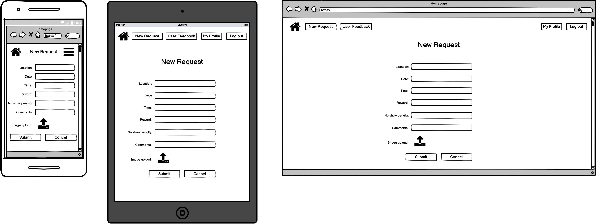
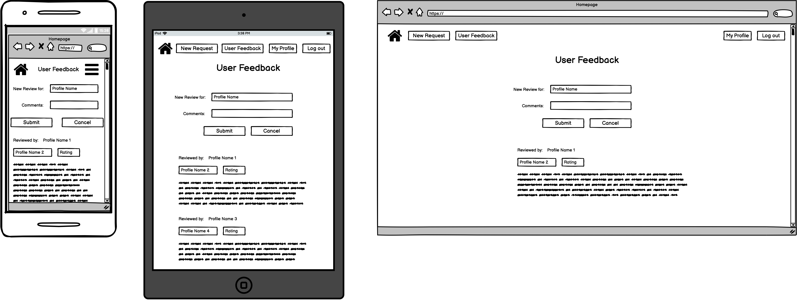
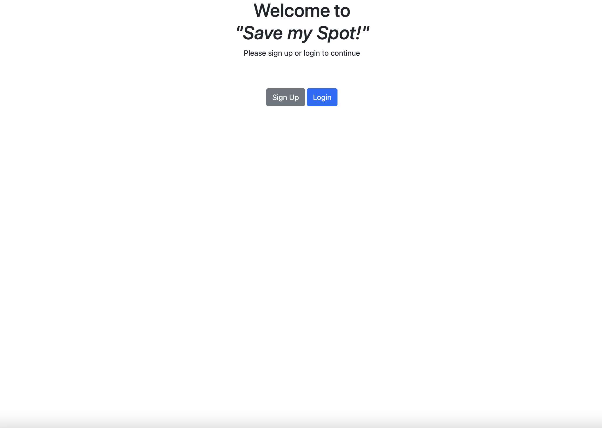

# T2A2 - Marketplace Application (Christopher Chong)
---

 ## Description of Application

- Identification of the problem and how to solve it?
  - Trying to solve an issue to do with street parking where parking spots are very limited or where first come first serve is the name of the game.  By having a means to book a spot, this will attempt to solve the issue.  This is by no means a 100% guaruntee spot saving system, but it aims to give those who really want a spot a fighting chance to secure a space by letting it known to the world.  This will allow someone who is able to save/secure a parking spot to help and get rewarded in the process.

- Why is it a problem that needs solving?
  - Time and time again, I have found myself in this exact scenario, whereby there are limited spots to street parking and it is a first come first serve basis.  I kept thinking if only there was a way to secure this spot before hand, it would make life so much easier.  I have heard similar stories from other drivers, so I know I'm not the only one thinking the same thing.

- Purpose of the application?
  - The purpose of the app is to provide a platform for someone in need of saving a parking spot (will be referred to as the 'customer') and someone who is willing to reserve this spot (will be referred to as the 'provider').  The 'customer' will post up a request on the website, with the location, date, time and reward on offer.  The 'provider' can either choose to accept or look for another opportunity.  If the 'provider' accepts the request, they will need to ensure that the spot can be secured, which is why the reward/payment will not be released to the 'provider' until the request has been physically fulfilled (i.e. the 'provider' waits for the 'customer' to arrive at the agreed spot and the car spot is given to the 'customer').  Upon completion of the request, the reward/payment will be released to the 'provider'.

- Target audience?
  - The target audience is anyone in need of securing a parking spot that cannot otherwise be secured through other means wihtin Australia.  It doesn't restrict to only those with vehicles, it could for example also include person travelling with someone with a vehicle.  

---

 ## Link to deployed Application website

Heroku:

https://floating-plateau-30854.herokuapp.com/
 
https://git.heroku.com/floating-plateau-30854.git

---

 ## Link to Source Control Repository

Github:

https://github.com/chrismyhub/save_my_spot

---

## User Stories

Trello:

https://trello.com/b/eOdxzMuF/marketplace-app-kanban

  

---
## Features/Functionality
This Marketplace Application will have the following features/functionalities:

1. Display all requests currently available.
   - This feature will allow all users to see what requests are available to accept near them.

2. Create new requests and add them to the current listing.
   - This feature will allow those who want to request a spot to be saved to post their requests and let it be known, so that a potential 'provider' can assist with the request.

3.  Edit current requests posted.
   - This feature will allow the original poster to edit the request in case there are changes to the initial plan.

4. Delete current requests posted.
   - This feature will allow the original poster to remove the request in case there has been a change in plans or no longer required.

5. Allow users to leave feedback and rating on their experience with other users through the platform.
   - So that others can be informed of a positive or negative experience if deciding whether or not to engage the 'provider' or to assist with a potential 'customer'.

6. Allow users to generate a profile so that personal information necessary to carry out the request can be exchanged when needed.  
   - Information such as name, contact number and vehicle details so that both the 'provider' and 'customer' can identify each other on the day of the exchange.

7. Allow user's profiles to attach a vehicle or multiple vehicles.
   - This will allow vehicle details such as vehicle type, color, make, year of manufacture and license plate to be added for engaged users to easily identify one another on the day of the exchange.

---
## Sitemap

---
## Wireframes
#### Landing Page	

#### Listings Page	

#### New Request Page	

#### Profile Page	

#### Request Details Page	

#### User Feedback Page	

#### Vehicle(s) Page	

---
## Screenshots of Application	

---

### Entity Relationship Diagram (ERD):

---

### High Level Components / Database Relations

The Entity Relationship Diagram (ERD) entities in this application:
1. User
   - The 'User' entity contains two attributes, 'email' and 'password', both are string data types.  It has a one-to-one relationship with the 'Profile' entity.
   - The 'User' entity is primarily used for logging into the application with the help of a Ruby Gem 'Devise'.  The user will either login or sign up with their email address and desired password, which need to be at least six letters long.
  
2. Profile
   - The 'Profile' entity contains three attributes.  The 'name' and 'australian_state' attributes contain string data types, whilst the 'phone_number' attribute is an integer data type.  'Profile' has a one-to-many relationship with 'Feedback', 'Request' and 'Vehicle' entities. 
   - The 'Profile' entity contains each user's personal information, such as name and phone number.  It is the common connection between all other entities and allows the flow of code to have a central reference point.  It's primary purpose is to give the user a unique identity whilst using the application.  This unique identity will allow the user to add vehicles to their profile and keep track of who is posting what request to the listing.
  
3. Vehicle
   - The 'Vehicle' entity contains six attributes. The 'year' attribute is an integer data type whilst 'vehicle_type', 'color', 'license_plate', 'make' and 'comments' are all string data type.  'Vehicle' has a many-to-one relationship with 'Profile and a one-to-many relationship with 'Request'.  
   - The 'Vehicle' entity provides a means to fulfil the request being posted on the listing page.  It acts as both the 'Provider' and 'Customer', as a vehicle can be used to reserve the spot being requested, as well as arriving at the spot being requested.  Since a single user can have multiple vehicles, this entity manages all vehicles belonging to a user under their user profile.
  
4. Request
   - The 'Request' entity contains eight attributes.  One attribute is an 'image' upload function.  Two attributes 'reward' and 'no_show_penalty' are both float data types.  The remaining, 'location', 'australian_state', 'date', 'time' and 'comments' are all string type data.  It has a many-to-one relationship with 'Profile' and a many-to-one relationship with 'Vehicle'.
   - The 'Request' entity facilitates the core function of the application, which is managing the requests posted by the users.  A central location for all data related to the request such as the actual location, date and time the parking spot is needed.  The reward serves as an indication of what the customer is willing to pay for reserving the parking spot and the no-show penalty will be enforced if for example the provider does not make good on his/her end of the deal.  There is also an image upload facility to enable the customer to upload an image of the required spot or a map indicating what areas are acceptable.  When a user posts a request, they become the 'Customer'.  When a user accepts a request, they become the 'Provider'.  
  
5. Feedback
   - The 'Feedback' entity contains three main attributes and two foreign key attributes.  The foreign key attributes, 'customer_profile_id' and 'provider_profile_id' are both integer type data.  The other integer type data is 'rating', whilst 'profile_name' and 'comments' are both string type data.  It has a many-to-one relationship with 'Profile'.
   - The 'Feedback' entity exists to manage all user's experience which are posted against their profile.  The rating allows users to indicate what they felt the experience deserved between 1 and 5, where 1 is 'poor' and 5 is 'excellent'.  The foreign keys will help to differentiate between a customer and provider.  
  

In terms of Model, View and Controller (MVC), the application will have four controllers in addition to the application_controller.rb.  There will be controllers for 'feedbacks', 'profiles', 'requests' and 'vehicles'.  Each of these entities will perform Create, Read, Update and Delete (CRUD) operations to some extent.  So it is important to seperate these CRUD operations into their specific entity, to enable organisation of methods and also for future developers who might be reading the code from scratch.  It will give it more meaning and clarity when sorted in this manner.  The 'User' entity will be handled by Ruby 'Devise' Gem so its operations will be organised according to the Gem's file structure.  So there is no need to generate a seperate controller for 'User'.

The application will have five seperate models, one for each entity.  It is set up this way, so that it is clear cut what model is serving what controller.  It also makes assigning relationships between the models easier and without confusion.  If models were to be combined, it could get very messy, much the same can be said about the controllers.  The advantage of having models set up seperately like this, is if say a component of the application needed to be changed, these changes could be gradually implemented one entity at a time, rther than having to do a complete overhaul all at one go.  by doing it gradually it will help with easier troubleshooting, because you're only dealing with one aspect of the appplication, rather than it as a whole.  

For the views, the application will have one view for 'profiles', 'requests' and 'vehicles'.  The 'feedbacks' view will be nested inside the 'profile' view.  The navigation bar that exists on all pages will fall under the application.html.erb file and then each 'entity' view will come underneath the navigation bar.  The reason why 'feedbacks' will not be needing a view is because the intention is to post feedback directly to the profile, so it will fall under the 'profile' page's view.  The other entities will have their own views because the data in each entity needs to be represented slightly differently from one another.  This also give each entity future expansion capabilities.  For example if additional features were to be planned for 'profiles' to include a photo upload or internal and external emailing system, it would be easier to handle all of this under the 'profile' views and model for that matter.

---
### Third party services

1. This applciation is using a Ruby Gem called 'Cloudinary' that connects to a third party service provider to host photos.

2. This application uses 'Heruko' which is a third party service provider for application deployment.

---
### Active Record Associations

1. User Model
   - User has_one :profile
     - This is to limit each user to only one profile, essentially one person has only one identity.
   - User has_many :feedbacks
     - Each user can have more than one feedback comment so this association ensures this.
  
2. Profile Model
   - Profile belongs_to :user
     - This is to ensure only one profile is assigned to one user.
   - Profile has_many :feedbacks
     - A profile can have more than one feedback from other users.
   - Profile has_many :requests
     - A profile can have more than one request at a time, different locations and times.
   - Profile has_many :vehicles
     - A profile can have more than one vehicle attached, if a user owns more than one vehicle.
  
3. Vehicle Model 
   - Vehicle belongs_to :profile
     - A vehicle can only belong to one person, so only assigned to one profile.
   - Vehicle has_many :requests
     - A vehicle can be attached to more than one request, different locations and time slots.
  
4. Request Model
   - Request belongs_to :profile
     - A request can only come from one person, so only assigned to one profile.
   - Request has_one :vehicle
     - Only one vehicle can accept one request.
   - Request has_one_attached :image
     - This is to allow the customer to upload one image to help with the request.
  
5. Feedback Model
   - Feedback belongs_to :user
     - Any one feedback comment can only come from one person, so assigned to one user.
   - Feedback belongs_to :profile
     - Each feedback comment can only go to one person (at a time), so assigned to one profile.

---
## Allocation of Tasks and Project Tracking

I have split my tasks out into the five entities in my application and then seperate tasks for authentication, authorisation, validation and deployment.  I took a component approach to task allocation as it made sense to implement each entity one at a time and see how the next entity would react to the existing one.  My concern of taking a more bulk model, bulk controller and bulk views approach is that any troubleshooting could come from multiple places, so it would be more time wasted in looking for the source of the issue.  A single entity can only have so many places that problems could arise from.

I am using Trello to track progress of my Marketplace application as it gives a good visual snapshot of where everything stands at any given day.  My user stories are right there in Trello as well, to remind me of what each task is attempting to achieve and if I need to change the way I apporach the application, I will have the core idea still standing there to reference.

---

### Trello Progress tracking
#### 10th May 2022:

 

#### 16th May 2022:

 

#### 17th May 2022:

 

#### 18th May 2022:

 

#### 19th May 2022:

 

#### 20th May 2022:

---

### TECH STACK
- HTML 5
- CSS 3
- Ruby on Rails 7.0.2.3
- Ruby Gems:
  - Bootstrap
  - Devise
  - Rolify
  - Pundit
  - Bundler
  - pg
  - ffi
- Deployment Platform: Heruko
- Cloud image hosting: Cloudinary
  

 ---
 ## <u>REFERENCED SOURCES</u>
 

1.  Trello.com. 2022. Trello. [online] Available at: < https://trello.com/ > [Accessed 10 May 2022].
 
 
2.  GitHub. 2022. GitHub: Where the world builds software. [online] Available at: < https://github.com/ > [Accessed 10 May 2022].
 
 
3.  draw.io. 2022. draw.io – Diagrams for Confluence and Jira. [online] Available at: < https://drawio-app.com/ > [Accessed 10 May 2022].
 
 

